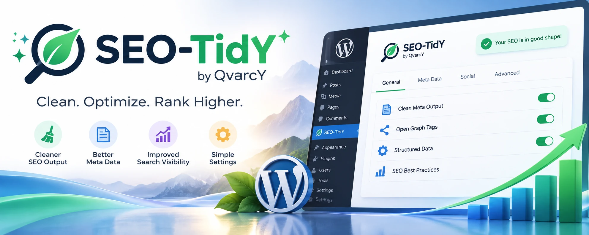

# SEO-TidY

**Free, open-source WordPress SEO and AI search readiness plugin by QvarcY.**

Clean SEO. Smarter discovery. Completely free.

## Release status

**Latest stable release: [SEO-TidY 1.0.0](https://github.com/QvarcY/wordpress-seo-tidy/releases/tag/v1.0.0)**

Download **[seo-tidy-1.0.0.zip](https://github.com/QvarcY/wordpress-seo-tidy/releases/download/v1.0.0/seo-tidy-1.0.0.zip)** from GitHub Releases under **Assets**. This is the ready-to-install WordPress plugin. Do not use GitHub's automatically generated source archives.

SEO-TidY 1.0.0 is the first stable release, intended for regular WordPress use. Requirements: WordPress 6.8+ and PHP 8.1+. As with any site plugin, keep a backup before updating.

## Features

- Custom SEO titles and meta descriptions for posts and pages
- WordPress block editor and classic editor metadata support
- Quick metadata editing in the SEO-TidY administration panel
- Automatic BlogPosting and WebPage JSON-LD structured data
- Search result previews with title and description guidance
- SEO audit for duplicate metadata, noindex settings, headings and image ALT
- Outgoing and incoming internal content link recommendations
- Review of missing or unpublished WordPress post-ID link targets
- Affected URL details for supported link checks
- Cached incoming link and duplicate metadata analysis
- SEO metadata and content audit
- Answer readiness content-structure suggestions
- Yoast SEO and Rank Math metadata import
- Centralized output and audit settings
- English and Latvian administration interface
- Optional local daily pageview analytics with separate suspected-bot counts
- Configurable statistics badge with shortcode `[seo_tidy_stats]`
- Optional statistics badge in the website footer
- Light, dark and transparent badge themes
- Opt-in Wall of Fame directory with verified submissions, moderated editable website profiles, public SEO-friendly profile pages, moderator notifications and a compact paginated directory
- Administrator-controlled statistics deletion and daily data retention

Content recommendations are heuristic and do not guarantee search
rankings, indexing, or inclusion in AI-generated answers.

## Requirements

- WordPress 6.8 or newer
- PHP 8.1 or newer

## Installation

1. Open the [stable 1.0.0 release](https://github.com/QvarcY/wordpress-seo-tidy/releases/tag/v1.0.0) and expand **Assets**.
2. Download **[seo-tidy-1.0.0.zip](https://github.com/QvarcY/wordpress-seo-tidy/releases/download/v1.0.0/seo-tidy-1.0.0.zip)** (not the source archives).
3. In WordPress, open Plugins > Add New Plugin > Upload Plugin.
4. Select the downloaded ZIP and choose Install Now.
5. Activate SEO-TidY.
6. Open SEO-TidY in the WordPress administration menu.

The ZIP already contains compiled JavaScript assets.
Node.js and npm are not required for normal installation.

## Getting started

1. Open Dashboard to see published content statistics.
2. Open Metadata to review and edit SEO titles and descriptions.
3. Open Smart Schema or Settings to control structured data.
4. Open SEO Audit and Answer Readiness for content suggestions.
5. Use Migration only after making a database backup.

Migration imports available metadata into empty SEO-TidY fields.
It does not intentionally delete the source plugin's metadata.
Review the preview and confirm before importing.

Using multiple SEO plugins at once may create duplicate metadata
or structured data. Check the public page output before deployment.

## Analytics and privacy

SEO-TidY Analytics is **disabled by default**. Enabling it records
aggregated daily counts of eligible public page requests in the
WordPress database. The analytics engine does not persist raw IP
addresses or create a separate visitor event log.

- Human-classified pageviews are requests, not unique visitors.
- Suspected bots are identified heuristically from user agents.
- The bot classification can be inaccurate or manipulated.
- WordPress administrators and logged-in users are excluded.
- Non-GET and several non-public requests are excluded.
- Full-page caches, CDNs and other caching layers may bypass
  WordPress, so totals may be lower than actual traffic.
- The built-in engine does not calculate reliable unique visitors
  or real-time online visitor counts.
- Statistics are stored by calendar day for up to 365 days.
- Old rows are removed using WordPress scheduled tasks.
  WordPress cron depends on site activity or external cron setup.
- Administrators can explicitly delete all recorded statistics
  from the Analytics screen after a confirmation prompt.

The statistics badge is optional. The footer badge and the
Powered by SEO-TidY attribution are disabled by default.
The shortcode can be used where a badge is wanted.

Wall of Fame is optional. Owners submit their website for verification and moderator review. Approved website names, URLs and descriptions appear in the public community directory. Approved site owners can submit a detailed profile with category and tags for moderation; public profiles have crawlable HTML pages. The directory is also shown in the SEO-TidY dashboard with pagination and profile links. Central moderation is limited to the authorized hosting environment.

Site owners remain responsible for providing appropriate privacy
information to their visitors.

## Development

Install dependencies with `npm ci` and build with `npm run build`.

Source code: https://github.com/QvarcY/wordpress-seo-tidy

## License

GPL-2.0-or-later. See [LICENSE](LICENSE).

## Support

- GitHub: https://github.com/QvarcY
- Report an issue: https://github.com/QvarcY/wordpress-seo-tidy/issues
- Buy Me a Coffee: https://buymeacoffee.com/craftin

Donations are optional. Every SEO-TidY feature remains free.